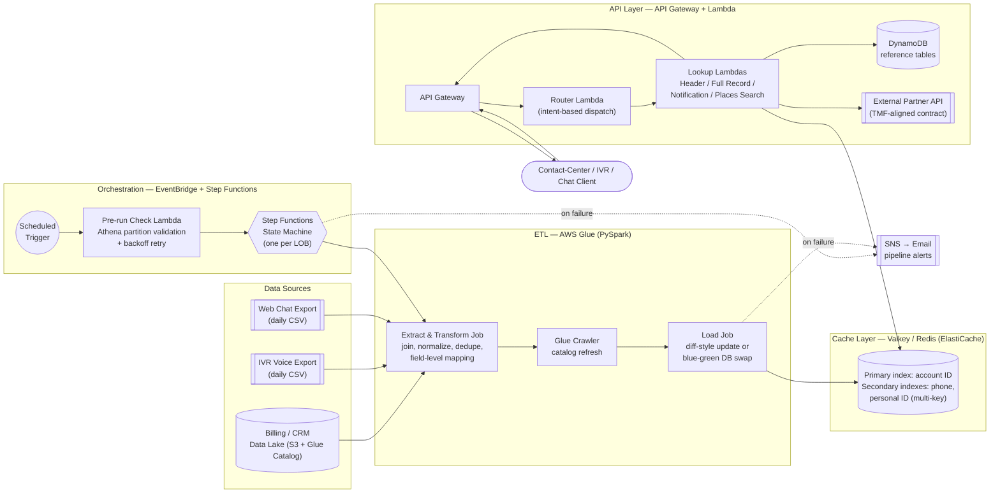
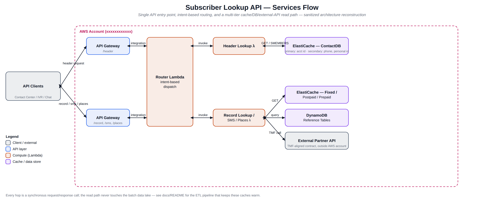
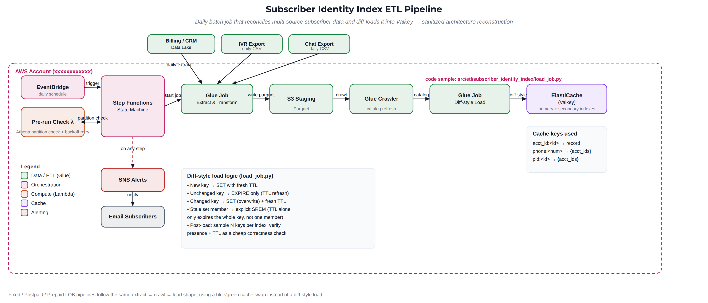

# Telecom Subscriber Cache Platform

A production-pattern AWS data platform that ingests telecom subscriber data from an S3-based data lake, cleans and transforms it through AWS Glue (PySpark), and serves it as low-latency REST responses through a Valkey/Redis cache layer — built to support real-time customer identification for contact-center and IVR/chat channels.

[](#tech-stack)
[](#tech-stack)
[](LICENSE)

This repository is a **sanitized, portfolio-oriented reconstruction** of a system originally designed and built by [Mario May](https://github.com/kanutomay) for a telecom operator's cloud-based subscriber services platform. Company-specific identifiers (AWS account IDs, VPC/subnet IDs, S3 bucket names, internal system names) have been removed or genericized — see [Author's Note](#authors-note--provenance) at the bottom.

> **Portfolio scope:** This is a partial reconstruction, not a complete or directly deployable copy of the production platform. Selected components contain representative sanitized code; the remaining directories document responsibilities and omitted components. Real customer data, credentials, employer code, production configuration, and identifying infrastructure details are not included.

**Start with the one-page case study:** [View the PDF](docs/case-study/Telecom_Subscriber_Identity_Platform_Case_Study.pdf)

## Table of Contents

- [Telecom Subscriber Cache Platform](#telecom-subscriber-cache-platform)
  - [Table of Contents](#table-of-contents)
  - [Overview](#overview)
  - [One-Page Case Study](#one-page-case-study)
  - [Architecture \& Data Flow](#architecture--data-flow)
    - [Diagrams](#diagrams)
  - [Tech Stack](#tech-stack)
  - [Key Technical Features](#key-technical-features)
  - [Portfolio Implementation Status](#portfolio-implementation-status)
  - [Repository Layout](#repository-layout)
  - [Conceptual Deployment Outline](#conceptual-deployment-outline)
  - [Verification \& Testing](#verification--testing)
  - [Author's Note / Provenance](#authors-note--provenance)

## Overview

Contact-center and self-service channels (IVR, web chat, live agents) need to identify a calling customer in near real time — by account ID, phone number, or personal ID — and hand back enough account context to route the interaction correctly. The source of truth for that data lives in a batch-oriented billing/CRM data lake, which is far too slow (and not built) to serve sub-second lookups directly.

This platform closes that gap with two cooperating halves:

1. **Batch ETL pipelines** (one per line of business — Fixed, Mobile Postpaid, Mobile Prepaid, and a cross-LOB Subscriber Identity Index) that run on a daily schedule, extract and reconcile subscriber records from the data lake plus IVR/chat export files, and load the results into a purpose-built cache.
2. **A REST API layer** that fronts the cache with a request router and a set of purpose-built lookup services, keeping data-lake and relational reads out of the latency-sensitive identification path.

The production solution directly addressed a long-standing defect where multi-account customers could not be reliably identified in near real time (see [Key Technical Features](#key-technical-features)). During the period I supported it, I observed roughly 500K subscriber records processed per daily cycle across four pipelines and sub-200ms API responses under the workloads available to me. These are practitioner-reported production observations, not reproducible benchmarks supplied by this repository.

## One-Page Case Study

For a recruiter- and interview-friendly summary of the problem, architecture, personal contribution, key decisions, and reported production outcomes, see the **[Telecom Subscriber Identity Platform case study (PDF)](docs/case-study/Telecom_Subscriber_Identity_Platform_Case_Study.pdf)**.

The case study uses **Telecom Subscriber Identity Platform** and **Subscriber Identity Index** as descriptive public names. They replace internal project/component identifiers while preserving the underlying architecture and domain terminology. This repository's name emphasizes the cache-platform implementation that supports that broader identity-resolution capability.

## Architecture & Data Flow



**Batch path.** Each of the four pipelines runs on its own EventBridge schedule. A pre-run check Lambda first confirms the day's upstream Athena partitions actually exist (retrying on a backoff schedule rather than failing fast, since upstream jobs occasionally land late), then a Step Functions state machine drives two Glue jobs: an *extraction* job that reads the data lake plus the daily IVR/chat export files, applies the field-level source-to-target mapping, normalizes phone-number formats, and writes Parquet to a staging prefix; and a *load* job that reads that Parquet, builds primary and secondary cache indexes, and writes them into ElastiCache. A Glue Crawler refreshes the Data Catalog between the two jobs so the load job always reads current partitions. Every pipeline publishes success/failure to SNS, which fans out to email subscribers.

**Cache load strategy.** Two load strategies are used depending on the LOB's data-volatility profile: a **blue/green swap** (write to a staging logical DB, validate key counts, then atomically swap staging and production, reverting automatically if post-swap validation fails) for the higher-volume slow-changing LOBs, and a **diff-style incremental update** for the Subscriber Identity Index, where each key is compared against its previous state and only new/changed/removed entries are written — new keys get a fresh TTL, unchanged keys just get their TTL refreshed, and changed keys are overwritten with a refreshed TTL. This avoids a full daily rewrite of a much larger, multi-index dataset while still bounding staleness through TTL expiry.

**Real-time path.** The API layer sits in front of the cache. A single API Gateway endpoint hits a router Lambda that inspects the request's intent and market and dispatches to one of several purpose-built Lambdas: a lightweight **header lookup** (returns all account IDs/phone numbers/personal IDs associated with a caller so the client can disambiguate multi-account customers before requesting full detail), a **full-record lookup** that layers in DynamoDB reference data and an external partner API call, an **SMS notification** service, and a **places-search** service. Every lookup Lambda talks to Redis directly rather than through the router, keeping the hot path to a single hop.

### Diagrams

Two more detailed diagrams — independently redrawn from the original design docs using generic identifiers, with all real AWS account/network identifiers replaced by placeholders — cover each half of the system in more depth:

**API services flow** (real-time read path, request routing, cache/DB/partner-API fan-out):



**Subscriber Identity Index ETL pipeline** (batch orchestration, diff-style cache load, alerting):



## Tech Stack

**Cloud / Infrastructure**
- Amazon S3 (data lake, staging, Parquet output)
- AWS Glue Data Catalog & Crawlers
- Amazon VPC (private subnets for cache/Glue connectivity)
- Amazon EventBridge (scheduled triggers)
- Amazon SNS (pipeline alerting)

**Processing / ETL**
- AWS Glue (Spark 3.x / Glue 5.0 runtime)
- Apache PySpark (DataFrame transforms, joins, dedup, `explode`/`collect_set` for index building)
- AWS Step Functions (batch orchestration, retries, error branching)
- AWS Lambda (pre-run checks, orchestration glue)
- Amazon Athena (partition existence checks, ad-hoc querying)

**Storage / Cache**
- Amazon ElastiCache for Valkey (Redis-compatible, primary + secondary index caching)
- Amazon DynamoDB (reference/lookup tables)
- Parquet on S3 (interchange format between ETL stages)

**APIs**
- Amazon API Gateway (REST)
- AWS Lambda (Python 3.9–3.12, intent-based routing and lookup services)
- External TMF-aligned partner API integration

## Key Technical Features

**Solving multi-account customer identification in near real time.** The original design could only resolve the *first* account tied to an inbound caller, so multi-account customers whose query was about a different account got an incomplete response. This was root-caused by reverse-engineering the existing Redis key design against real production traffic (no design documentation existed for the legacy behavior), which surfaced that account-level "contact phone" fields were being used as cache keys even though the same phone number is frequently shared across multiple accounts (e.g., a family's shared contact number). The fix: a two-step **header/detail** query pattern — the client first calls a lightweight header endpoint that returns every account/phone/personal-ID association for the caller, lets the customer (or IVR menu) disambiguate, and only then requests full account detail for the confirmed account — backed by a Redis key design where phone numbers and personal IDs are **secondary indexes holding sets of account IDs**, not primary keys.

**Schema handling at scale.** A field-level mapping specification covering 423+ mappings across the Fixed, Mobile Postpaid, Mobile Prepaid, and Subscriber Identity Index domains drives the transform logic, including per-field transformation rules and confidence/credibility ratings so downstream consumers know which fields are authoritative versus best-effort. Phone-number normalization accounts for national vs. international formats and country-specific numbering rules (mobile vs. fixed-line prefixes and digit counts) so records from multiple countries flowing through a shared export pipeline are correctly parsed.

**Latency optimization.** Identification read paths use cache-only Redis operations against pre-built indexes rather than querying the data lake or a relational store. A direct account lookup uses `GET`; a secondary lookup uses `SMEMBERS` followed by retrieval of the associated account records. Index design (list vs. set vs. string, per LOB) is chosen from the access pattern rather than defaulted to one shape.

**Fault tolerance.** Pre-run partition checks with bounded, backed-off retries prevent pipelines from running against incomplete upstream data. Cache loads validate post-write key counts and automatically roll back a blue/green swap if validation fails, so a bad load never reaches production traffic. Every pipeline failure — Step Functions or an individual Glue job — is pushed to SNS and fanned out by email, and a validation-sampling step spot-checks a handful of keys per index after every load as a cheap correctness signal.

**Zero-downtime cache reloads.** Both the blue/green swap and the diff-style update paths are designed so the cache is never emptied or unavailable mid-reload — reads continue to be served against the current data while the next day's data is being validated and swapped/merged in.

## Portfolio Implementation Status

| Area | Status in this repository |
|---|---|
| Architecture and design decisions | Documented with sanitized, independently redrawn diagrams |
| Router Lambda | Representative sanitized implementation |
| Header Lookup Lambda | Representative sanitized implementation |
| Subscriber Identity Index differential load | Representative sanitized Glue/PySpark implementation |
| Structured logging | Representative sanitized implementation |
| Record Lookup, SMS, Places Search | Contracts and responsibilities documented; handlers intentionally omitted |
| Fixed, Postpaid, Prepaid ETL | Architecture and responsibilities documented; production jobs intentionally omitted |
| Step Functions | Workflow responsibilities documented; deployable ASL intentionally not included |
| Acceptance testing | Sanitized test approach and retained counts documented; production payloads/results intentionally not included |

The status above is deliberate: the portfolio focuses on the architecture decisions and selected implementation patterns that can be shown responsibly without publishing employer-owned code or production data.

## Repository Layout

```
telecom-subscriber-cache-platform/
├── README.md
├── LICENSE
├── docs/
│   ├── case-study/
│   │   ├── Telecom_Subscriber_Identity_Platform_Case_Study.pdf
│   ├── architecture/
│   │   ├── api-services-flow.png        # Real-time read path diagram
│   │   └── subscriber-identity-index-etl-pipeline.png  # Batch ETL diagram
│   ├── api-reference.md         # Request/response contracts per endpoint, error codes
│   └── subscriber-identity-index-design-notes.md  # Header/detail design + Redis key strategy
├── src/
│   ├── api/
│   │   ├── router/               # ★ handler.py — intent-based dispatch Lambda
│   │   ├── header_lookup/        # ★ handler.py — multi-account disambiguation service
│   │   ├── record_lookup/        # Full account/contact record service (+ DynamoDB, partner API)
│   │   ├── sms_notification/     # Outbound SMS notification service
│   │   └── places_search/        # Store/branch locator service
│   ├── etl/
│   │   ├── subscriber_identity_index/  # ★ load_job.py — diff-style Redis load (flagship sample)
│   │   ├── fixed_lob/            # Fixed-line subscriber pipeline: extract + blue/green load jobs
│   │   ├── postpaid_lob/         # Mobile postpaid subscriber pipeline
│   │   └── prepaid_lob/          # Mobile prepaid subscriber pipeline
│   └── common/                   # ★ structured_logger.py — shared structured JSON logging
├── infra/
│   └── step_functions/           # Documented state-machine responsibilities (no deployable ASL)
└── tests/
    └── atp/                      # Sanitized ATP approach and retained test counts
```

★ marks representative sanitized implementations. Other component directories are intentional documentation scaffolds, not claims of included deployable services.

## Conceptual Deployment Outline

> This is an architecture walkthrough, not a runnable deployment guide. Required infrastructure definitions, omitted handlers/jobs, IAM policies, dependency packaging, and environment-specific security configuration are not supplied.

**1. Provision the data plane**
- Create the ElastiCache (Valkey/Redis) clusters — one per LOB pipeline — inside a private VPC subnet group reachable by your Glue jobs and Lambda functions.
- Create the S3 staging/output prefixes and register them with a Glue Database via a Crawler.

**2. Implement and deploy the ETL pipelines**
- Use the documented responsibilities under `src/etl/<lob>/` to implement the omitted extraction/load jobs; the Subscriber Identity Index load job is included as a representative pattern.
- Create a state machine per pipeline following `infra/step_functions/README.md`, wiring in the relevant Glue jobs, pre-run-check Lambda, crawler, and SNS topic.
- Schedule each state machine with an EventBridge rule (staggered start times if pipelines share upstream data).

**3. Implement and deploy the API layer**
- Package the included router and Header Lookup samples, and implement the omitted services from the contracts in `docs/api-reference.md`.
- Wire a single API Gateway REST resource to the router Lambda; the router dispatches to the other Lambdas via synchronous `lambda:invoke`.

**4. Call the API**

```bash
# Header lookup — resolve every account tied to a caller
curl -X POST https://<api-id>.execute-api.<region>.amazonaws.com/prod/header \
  -H "Content-Type: application/json" \
  -d '{
    "CORRELATION_ID": "b6f1...",
    "MARKET": "<market-code>",
    "INTENT_NAME": "HEADER-LOOKUP",
    "PHONE_NUMBER": "555-0100"
  }'

# Full record lookup — once the caller/account is confirmed
curl -X POST https://<api-id>.execute-api.<region>.amazonaws.com/prod/record \
  -H "Content-Type: application/json" \
  -d '{
    "CORRELATION_ID": "b6f1...",
    "MARKET": "<market-code>",
    "INTENT_NAME": "RECORD-LOOKUP",
    "ACCOUNT_ID": "ACCT-DEMO-0001"
  }'
```

Every request/response is expected to include a `CORRELATION_ID` for end-to-end tracing across the router, the target Lambda, and CloudWatch Logs.

## Verification & Testing

The production delivery used structured Internal Acceptance Test Procedures (ATPs) with test ID, description, input, expected result, actual result, pass/fail, and comments. Production payloads and result workbooks are intentionally excluded because they contain environment-specific data. Retained source records document:

- **Places Search API** — 16 designed scenarios. A retained execution snapshot recorded 12 executed, 10 passed, and 2 failed in its summary; the failures exposed routing/request-envelope integration assumptions that required follow-up.
- **SMS Notification API** — 21 documented scenarios covering message templating, optional and malformed fields, receiver collection validation, and destination-number rules.

This repository does not include a reproducible load-test harness or benchmark result, so it does not claim an independently verifiable p95 measurement. Batch correctness controls represented in the design include post-load validation sampling and reconciliation against source record counts during rollout or transformation changes.

## Author's Note / Provenance

This repository presents the **architecture, design decisions, and engineering approach** of a system I designed and built end-to-end — requirements, data pipelines, API contracts, and test procedures — while working as a cloud/data engineer for a telecom operator. It is intentionally **not** a verbatim copy of the production codebase or its diagrams: AWS account IDs, VPC/subnet/security-group IDs, internal S3 bucket names, internal endpoint hostnames, and proprietary system/brand names have been removed or replaced with placeholders throughout the code samples. Both diagrams under `docs/architecture/` were independently redrawn with generic identifiers rather than exported from employer documents.

The representative samples preserve the essential architectural patterns and selected decision logic — including intent-based routing, the header/detail lookup pattern, multi-account secondary indexes, and differential Redis reconciliation — while changing identifiers, implementation details, error handling, logging, and security-sensitive configuration. They should be evaluated as explanatory portfolio code, not as a source distribution of the production system. Request/response logs carry routing metadata rather than raw account payloads, public error responses do not echo exception details, and Redis authentication/TLS are explicitly left as deployment-specific requirements.

If you're reviewing this as part of a hiring process, I'm happy to walk through the design decisions, trade-offs, and engineering challenges behind this in more depth — feel free to reach out.
